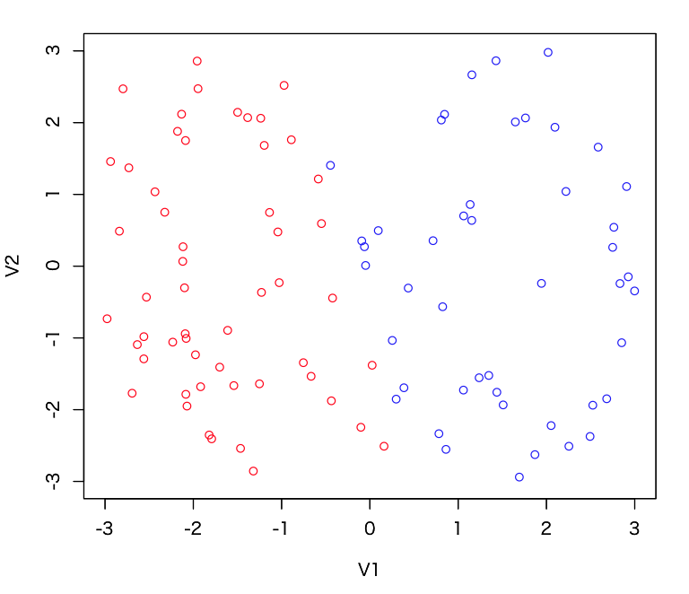

# Scala - Logistic Regression
===
simple implementation using scala.

## How to use
```scala
val gold:List:List[(Double, Double, Double)] = YOUR_TRAINING_DATSET
val logisticregression = new LogisticRegression
val w:List[Double] = logisticregression.train(gold)
```

## Exmaple


### Run
```
$ cd scala-logistic-regression
$ sbt run
```

### plot use R
```
$ cd scala-logistic-regression/output/
$ R
> lo <- read.table("lower.tsv", sep="\t")
> up <- read.table("upper.tsv", sep="\t")
> r = c(-3, 3)
> plot(lo, col=2, xlim=r, ylim=r)
> par(new=T)
> plot(up, col=4, xlim=r, ylim=r)
```

### Test
```
$ cd scala-logistic-regression
$ sbt test
```
